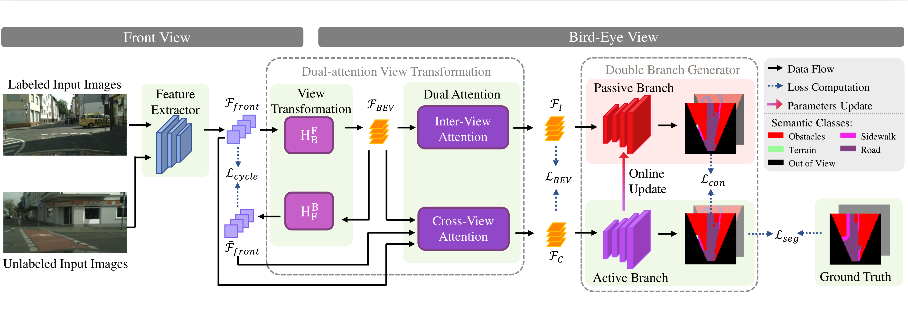
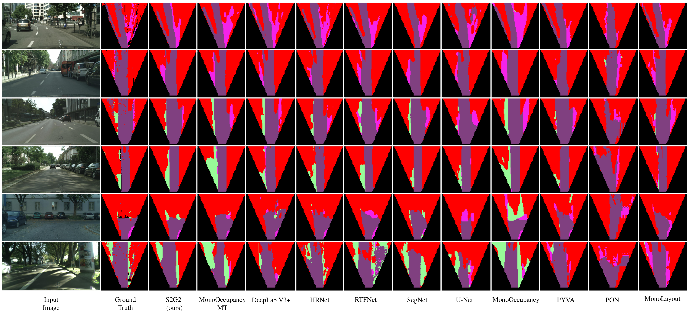

# S2G2: Semi-Supervised Semantic Bird-Eye-View Grid-Map Generation using a Monocular Camera for Autonomous Driving

This is the offical PyTorch implementation of S2G2: Semi-Supervised Semantic Bird-Eye-View Grid-Map Generation using a Monocular Camera for Autonomous Driving (IEEE RA-L). 

The current version supports Python >= 3.8.10, CUDA >= 1.11.1 and PyTorch >= 1.10.1. Please modify the `Dockerfile` if you use different version. Other dependeces please refer to the `Dockerfile`.    

   

# Introduction   

Semantic bird-eye-view (BEV) grid map is a straightforward data representation for semantic environment perception. It can be conveniently integrated with tasks, such as motion planning, and trajectory prediction, to realize autonomous driving. Most existing methods of semantic BEV grid-map generation adopt supervised learning, which requires extensive hand-labeled ground truth to achieve acceptable results. However, there exist limited datasets with hand-labeled ground truth for semantic BEV grid map generation, which hinders the research progress in this field. Moreover, manually labeling images is tedious and labor-intensive, and it is difficult to manually produce a semantic BEV map given a front-view image. To provide a solution to this problem, we propose a novel semi-supervised network to generate semantic BEV grid maps. Our network is end-to-end, which takes as input an image from a vehicle-mounted front-view monocular camera, and directly outputs the semantic BEV grid map. We evaluate our network on a public dataset. The experimental results demonstrate the superiority of our network over the state-of-the-art methods.

# Contributions

- We propose S2G2, a novel semi-supervised semantic BEV generation network that can be trained with unlabeled data.   

- We introduce a new dual-attention view transformation module to transform the front-view input into the bird-eye-view feature maps.   

- We create several semi-supervised baseline methods and compare our network with the baselines and the state-of-the-art supervised methods.


# Dataset 

The original dataset can be downloaded from the [Cityscapes](https://www.cityscapes-dataset.com/downloads/) official page. We use the `leftImg8bit_trainvaltest.zip` as the labeled input and `leftImg8bit_trainextra.zip` as the unlabeled input. The BEV semantic ground truth which is corresponding to the `leftImg8bit_trainvaltest.zip`, can be get from [MonoOccupancy](https://ieeexplore.ieee.org/stamp/stamp.jsp?tp=&arnumber=8603774). We mixed the labeled and unlabeled data together as our input to the S2G2. You are encouraged to download our preprocessed dataset from [here](https://labsun-me.polyu.edu.hk/sgao/S2G2/dataset.zip). Please download, unzip and store the respective datasets in the `dataset/cityscapes` directory. The structure of the datasets is shown as follows: 
```
dataset/
`-- cityscapes
    |-- Cityscapes_frankfurt_GT
    |-- NO_LABEL_map.png
    |-- Semantic_Occupancy_Grid_Multi_64
    |-- leftImg8bit
    |-- leftImg8bit_extra_subset
    |-- leftImg8bit_extra_subset_1991
    |-- leftImg8bit_extra_subset_991
    `-- leftImg8bit_extra_subset_9992
```

# pretrained Models   

The following table provides links to the pretrained models for different amount of the unlabeled images in the training set. The table also shows the corresponding evaluation results for the models. 

| Proportion | mIoU(%) | mAP(%) | Pretrained Model |   
| :----: | :----: | :----: | :----: |
| 10% | 0.5894 | 0.7003 | [link](https://labsun-me.polyu.edu.hk/sgao/S2G2/Eff_b4_10.pth) |   
| 40% | 0.5889 | 0.6956 | [link](https://labsun-me.polyu.edu.hk/sgao/S2G2/Eff_b4_40.pth) |     
| 80% | 0.5879 | 0.7110 | [link](https://labsun-me.polyu.edu.hk/sgao/S2G2/Eff_b4_80.pth) |     

Please download the pretrained models and save them in the path `\weights\best_pth\`

# Training and Testing

1. Download the required dataset and pretrained models.   

2. Build a docker environment.  
We assume you already have [docker](https://docs.docker.com/engine/install/ubuntu/) and [NVIDIA Container Toolkit](https://docs.nvidia.com/datacenter/cloud-native/container-toolkit/install-guide.html) isntalled. To build a docker environment:      
```
$ git clone https://github.com/SarahGao-1995/S2G2.git   
$ cd /path/to/s2g2
$ docker build -t docker_image_s2g2 .
$ mkdir -p dataset/cityscapes/
$ cd ./dataset/cityscapes/
$ (Prepare the dataset as the instruction above)
$ cd ../..
$ mkdir -p weights/best_pth/
$ (Prepare the pretrained weights as the instruction above)
$ cd ../..
$ docker run -it --shm-size 8G -p 1234:6006 --name docker_container_s2g2 --gpus all -v /path/to/S2G2:/workspace docker_image_s2g2
```   
After those steps, now you should be in a docker container. 

3. Train the S2G2:   
For different S2G2 variants, please mannully modify `models['encoder']` and `fea_channels` in `train.py` according to the EfficientNet vatiants.
```
python3 train.py  --dataset cityscapes  \
                  --arch EfficientNet  \ 
                  --consistency 5  \
                  --consistency-rampup 100  \
                  --labeled-batch-size 4  \
                  --epochs 200  \
                  --batch-size 8  \
                  --lr 0.00005  \
                  --workers 8  \
                  --cycle-view-weight 1
                  --BEV-weight 1  \
                  --train-subdir CS_train_extra191.csv
```
Other arguments can be found in `/grid_map/cli.py`. The results will be saved in the `./runs` folder.

4. Test the S2G2:   
The pretrained weights are stored in `/weights/best_pth/`. 
```
python3 test.py  --dataset cityscapes  \
                 --arch EfficientNet  \
                 --labeled-batch-size 4  \
                 --epochs 200  \
                 --batch-size 8  \
                 --workers 8  \
                 --cycle-view-weight 1  \
                 --BEV-weight 1  \
                 --resume ./weights/best_pth/Eff_b4_10.pth
```

# Results   


# Citation   

